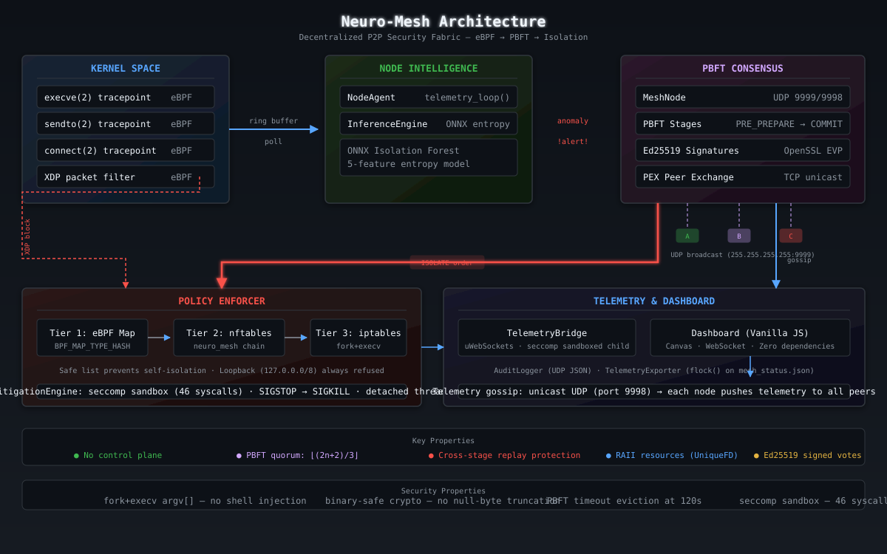

<p align="center">
  
  
  
  
  
  
  
</p>

<h1 align="center">NEURO-MESH</h1>

<p align="center"><b>No master. No control plane. No single point of failure.</b></p>

<p align="center">
  
</p>

---

Neuro-Mesh is a decentralized P2P security fabric. Every node runs eBPF kernel probes,
detects anomalies with entropy-based inference, votes on threats via Ed25519-signed
PBFT consensus over UDP, and enforces network isolation — all without a central
coordinator. If one node falls, the mesh votes and moves on.

```
    ┌──────────┐     eBPF probe     ┌────────────┐     PBFT vote     ┌────────────┐
    │  KERNEL  │ ──────────────────► │  NODE AGENT│ ────────────────► │  MESH P2P  │
    │  sensor  │    ring buffer     │  entropy AI│   Ed25519 sigs   │  UDP:9999  │
    └──────────┘                    └────────────┘                   └─────┬──────┘
                                                                          │
                                     ┌────────────┐     iptables         │ quorum
                                     │  ENFORCER  │ ◄────────────────────┘
                                     │  isolation │     EXECUTED
                                     └────────────┘
```

---

## Quick Start

### Prerequisites

```bash
# Ubuntu / Debian
sudo apt install clang-18 libbpf-dev libelf-dev zlib1g-dev \
  libssl-dev bpftool nlohmann-json3-dev libseccomp-dev \
  libonnxruntime-dev nftables iptables
```

| Dependency | Purpose |
|------------|---------|
| clang/LLVM 18+ | C++20 compiler + eBPF backend |
| libbpf, libelf, zlib | eBPF loader and BPF object handling |
| OpenSSL 3.x | Ed25519 signatures and TLS 1.3 mTLS |
| bpftool | eBPF skeleton generation |
| nlohmann-json3-dev | JSON parsing for evidence and telemetry |
| libseccomp-dev | Process sandboxing (seccomp BPF) |
| libonnxruntime-dev | Anomaly detection via ONNX inference |
| nftables / iptables | Network isolation enforcement |
| Docker (optional) | Containerized multi-node mesh |

### Build

```bash
make clean && make       # build neuro_agent
make tools               # build all CLI tools + test binaries
```

Binaries land in `bin/`: `neuro_agent` (the node), `inject_event` (threat injector),
`attack_injector` (adversarial UDP flood), `register_attacker` (keypair gen + TOFU),
and test binaries.

### Run a Single Node

```bash
./bin/neuro_agent ALPHA
```

### Launch a 5-Node Mesh

```bash
# Background processes
for node in ALPHA BRAVO CHARLIE DELTA ECHO; do
    NEURO_UNSAFE_NO_SANDBOX=1 ./bin/neuro_agent $node \
      &>/tmp/neuro_$node.log &
done

# Or via tmux grid
./mesh_dashboard.sh

# Or Docker Compose
docker compose up -d
```

### Dashboard

```bash
# Serve the dashboard (static HTML + WebSocket)
python3 -m http.server 8080 --directory dashboard/ &

# Open: http://localhost:8080
# The dashboard connects to ws://localhost:9000-9040 for live telemetry
```

Each node binds a unique WebSocket port:

| Node | WS Port | IPC Socket |
|------|---------|------------|
| ALPHA | 9000 | `/tmp/neuro_mesh_ALPHA.sock` |
| BRAVO | 9010 | `/tmp/neuro_mesh_BRAVO.sock` |
| CHARLIE | 9020 | `/tmp/neuro_mesh_CHARLIE.sock` |
| DELTA | 9030 | `/tmp/neuro_mesh_DELTA.sock` |
| ECHO | 9040 | `/tmp/neuro_mesh_ECHO.sock` |

A stateless WS proxy (`orchestration/ws_proxy.py`) on port 9001 tries all 5
backends with failover -- useful inside Docker or WSL2 where the browser can't
reach host-network ports.

---

## Attack Simulation

### Targeted Injection -- Make One Node Accuse Another

```bash
# Native (IPC socket)
./bin/inject_event --node CHARLIE --target ALPHA \
  --event entropy_spike --verdict CRITICAL

# Docker
docker exec neuro_charlie /app/inject_event \
  --node CHARLIE --target DELTA \
  --event entropy_spike --verdict CRITICAL --tag mytest
```

The injector sends `CMD:INJECT` over the node's Unix socket. The node kicks off a
PBFT round. Evidence is base64-encoded in the wire format -- pipe characters inside
JSON evidence cannot break the protocol.

### Python Attack Runner -- Full MITRE Scenarios

```bash
# Run a random MITRE ATT&CK scenario
python3 tools/attack_runner.py --random

# Run a specific scenario
python3 tools/attack_runner.py --scenario lateral_movement

# Replay a recorded session
python3 tools/attack_runner.py --replay recordings/session_2025.json
```

Four MITRE scenarios: `lateral_movement`, `ransomware`, `c2_beacon`, `supply_chain`.
21 event types with IPC-socket injection and Docker-fallback.

### Adversarial Testing — Flood + Auto-Ban

```bash
# Generate attacker keypair and get NEURO_PEER_KEYS value
./bin/register_attacker ZOMBIE
# output: NEURO_PEER_KEYS=ZOMBIE:<base64_pem>

# Boot a node with the pre-provisioned attacker key
NEURO_PEER_KEYS="ZOMBIE:<base64_pem>" ./bin/neuro_agent ALPHA

# Register the attacker via signed ANNOUNCE (TOFU bypass)
./bin/register_attacker ZOMBIE

# Flood with 800 forged VOTE messages over 4s
./bin/attack_injector --attacker-id ZOMBIE --duration 4 --rate 50 --threads 4
```

After 100 consecutive signature failures, the node auto-bans the attacker.
The heartbeat drains recent bans and initiates a cross-node `BAN_PEER` PBFT
round, propagating the ban to all mesh peers via 2f+1 quorum.

Full adversarial test suite:
```bash
sudo tests/integration/test_5node_adversarial.py      # 5-node UDP flood survival
sudo tests/integration/test_autoban.py               # auto-ban + cross-node propagation
```

### LLM Copilot

```bash
# Mesh status summary
python3 tools/llm_analyst.py status

# Explain the last event
python3 tools/llm_analyst.py explain

# Interactive ask mode
python3 tools/llm_analyst.py ask "What triggered the isolation of BRAVO?"
```

Uses OpenAI API if `OPENAI_API_KEY` is set, otherwise displays the raw prompt. Works offline.

### Proof Chain Verification

```bash
# Verify cryptographic integrity of a proof file
python3 tools/test_proof.py /tmp/neuro_proof_ALPHA.proof
```

Validates every link's hash chain and Merkle proof structure. Outputs `PASSED` or
pinpoints which link is broken.

---

## Architecture

```
eBPF kernel probe (kernel/sensor.bpf.c)
  |
  v
NodeAgent (cell/) -- polls ring buffer, feeds InferenceEngine
  |
  v
InferenceEngine (cell/) -- entropy analysis, ONNX anomaly detection
  |
  v
MeshNode (consensus/) -- UDP broadcast PBFT voting, Ed25519 signatures
  |
  v
PBFTConsensus (consensus/PBFT.hpp) -- multi-hop state machine (PRE_PREPARE/PREPARE/COMMIT/EXECUTED)
  |
  v
PolicyEnforcer (enforcer/) -- iptables + eBPF blocklist + process suspension
  |
  v
Telemetry gossip (TELEMETRY|node_id|json) to all peers via UDP:9998
  |
  v
TelemetryBridge (telemetry/) -- uWebSockets child process on unique port
  |
  v
Dashboard (dashboard/) -- vanilla JS, zero dependencies, Canvas + WebSocket
```

### Directory Map

```
neuro_mesh/
|-- kernel/              eBPF probes (sensor.bpf.c, neuro_bpf.c, vmlinux.h)
|-- cell/                Node intelligence (NodeAgent, InferenceEngine)
|-- consensus/           P2P mesh + PBFT consensus (MeshNode, PBFT, PeerManager)
|-- crypto/              Ed25519 identity (CryptoCore, KeyManager, ProofChain)
|-- enforcer/            Policy enforcement (PolicyEnforcer, MitigationEngine)
|-- telemetry/           Structured logging + WS bridge (TelemetryBridge, AuditLogger)
|-- net/                 TLS 1.3 transport layer (TransportLayer)
|-- attacks/             Attack simulation engine (AttackSimulator)
|-- orchestration/       Python tools (mesh_manager, ws_proxy, anomaly_classifier)
|-- dashboard/           Vanilla JS dashboard (HTML/CSS/JS, zero dependencies)
|-- tools/               CLI tools (inject_event, attack_injector, register_attacker, attack_runner, llm_analyst)
|-- main.cpp             Entry point
|-- common/              Shared utilities (UniqueFD, Result<T,E>)
|-- _archive_old/        Archived experiments
```

### Key Design Decisions

| Decision | Rationale |
|----------|-----------|
| PBFT over UDP broadcast to `127.0.0.1:9999` | All nodes on localhost; discovery is implicit via broadcast |
| Ed25519 signatures on every PBFT message | Prevents spoofed votes; binds `(stage + target + evidence)` |
| Safe list in PolicyEnforcer | Prevents node from isolating itself or critical infrastructure |
| Zero-trust self-vote | Self-votes verified through same `verify_message()` path as external votes |
| BAN_PEER auto-ban + cross-node propagation | 100 consecutive signature failures → auto-ban → heartbeat drains → broadcasts `BAN_PEER` PBFT round via 2f+1 quorum |
| Timeout-based PBFT cleanup | Rounds evicted after 120s of inactivity |
| fork+exec iptables | No shell injection; arguments passed as separate `argv[]` entries |
| RAII file descriptors | `UniqueFD` wraps raw socket FDs |
| Continuous eBPF drain | Ring buffer drained in tight `while(ring_buffer__poll()>0)` loop |
| TOFU (Trust On First Use) | TLS cert pinned on first discovery; no CA infrastructure needed |
| Binary-safe crypto | `std::string::data()`/`size()` used instead of `c_str()` |
| POSIX file locking | `flock()` on shared JSON sink prevents corruption |
| Proof chain (SHA-256 + Merkle tree) | Cryptographic audit trail of every consensus event |

---

## Environment Variables

| Variable | Default | Purpose |
|----------|---------|---------|
| `NEURO_UNSAFE_NO_SANDBOX` | (unset) | Set to `1` to bypass chroot+seccomp sandbox (dev only) |
| `NEURO_WS_PORT` | auto (9000-9040) | Override WebSocket port for telemetry bridge |
| `NEURO_XDP_IFACE` | auto-detect | Network interface for XDP attach (e.g., `eth0`); auto-scans `/sys/class/net` if unset |
| `NEURO_PEERS` | (none) | Comma-separated `ip:port` pairs for seed peers |
| `NEURO_MODEL_PATH` | `./isolation_forest.onnx` | Path to ONNX isolation forest model |
| `NEURO_IPC_TOKEN` | (none) | Shared secret for IPC socket authentication |
| `NEURO_WEBHOOK_URL` | (none) | URL for webhook alerts on consensus events |
| `NEURO_PEER_KEYS` | (none) | Comma-separated `node_id:public_key_pem` for pre-provisioned trust |
| `NEURO_PBFT_EVIDENCE_MAX` | 10240 | Max evidence payload size in bytes |
| `NEURO_PBFT_RATE_WINDOW` | 10 | Window in seconds for PBFT rate limiting |
| `NEURO_PBFT_RATE_MAX` | 5 | Max PRE_PREPARE messages per window |
| `NEURO_UDP_JITTER_MIN` | 0 | Min microseconds of jitter for UDP broadcasts |
| `NEURO_UDP_JITTER_MAX` | 0 | Max microseconds of jitter for UDP broadcasts |
| `NEURO_DISCOVERY_JITTER_MIN` | 0 | Min microseconds of jitter for discovery beacons |
| `NEURO_DISCOVERY_JITTER_MAX` | 0 | Max microseconds of jitter for discovery beacons |
| `NEURO_UNICAST_JITTER_MIN` | 0 | Min microseconds of jitter for unicast messages |
| `NEURO_UNICAST_JITTER_MAX` | 0 | Max microseconds of jitter for unicast messages |

---

## Security

| Property | Implementation |
|----------|---------------|
| Shell injection impossible | `fork()` + `execv()` with `argv[]`, never `system()` |
| FD leak prevention | `close_range()` syscall in all fork children -- no racy per-FD loops |
| Binary-safe crypto | `std::string::data()` / `size()` -- no null-byte truncation |
| Cross-stage replay protection | Signatures bind `(stage + target + evidence)` |
| Pipe-delimiter injection | Evidence base64-encoded in VOTE messages -- pipe chars in JSON don't break protocol |
| SSRF prevention | Webhook URL DNS-resolved and checked against 10 private IP ranges before curl fork |
| Self-isolation prevention | Safe list + loopback guard + self-vote EXECUTED quorum check |
| mTLS | TLS 1.3 with mutual certificate verification (CA path required), cert loaded from keystore |
| Bounded memory | PBFT rounds evicted at 120s; eBPF ring buffer drained in tight loop |
| Atomic telemetry | `flock()` on shared JSON sink |
| RAII resources | `UniqueFD` wraps all socket FDs |
| Crash recovery | `StateJournal` replays journal on boot |
| nftables compatibility | Handle-based rule deletion (`nft --handle list` -> parse -> `nft delete rule ... handle <N>`) |
| TOCTOU race prevention | `try_increment_peers()` atomic check-and-increment for concurrent peer discovery |
| POSIX signal safety | `global_running` uses `volatile sig_atomic_t` instead of `std::atomic<bool>` |

---

## WSL2 / Unprivileged Containers

Running without full root capabilities (WSL2, restricted Docker containers) has known limitations:

| Feature | Native Linux | WSL2 / Unprivileged |
|---------|-------------|---------------------|
| eBPF sensors | Full kernel probes | Falls back to `/proc/net/dev` entropy |
| iptables enforcement | Works | Requires `sudo` / `CAP_NET_ADMIN` |
| TelemetryBridge sandbox | Full chroot + seccomp + uid drop | Sandbox degrades gracefully (warn-and-continue) |
| PBFT consensus | Full -- no root needed | Full -- no root needed |
| Dashboard + telemetry | Full | Full |

PBFT consensus, telemetry gossip, and the dashboard work identically on WSL2.
Only kernel-level enforcement and eBPF probing are degraded.

To bypass the TelemetryBridge sandbox on unprivileged systems:
```bash
NEURO_UNSAFE_NO_SANDBOX=1 ./bin/neuro_agent ALPHA
```

---

## Production Deployment

### Requirements

| Component | Minimum | Recommended |
|-----------|---------|-------------|
| Linux kernel | 5.1+ (pidfd) | 5.15+ (full eBPF BTF) |
| Root privileges | Required (eBPF + iptables) | Full root with `CAP_BPF`, `CAP_NET_ADMIN`, `CAP_SYS_ADMIN` |
| OpenSSL | 3.0+ | 3.1+ |
| ONNX Runtime | 1.17+ | 1.18+ |
| Memory per node | 64 MB | 256 MB |

### Security Checklist

1. **Sandbox**: Do NOT set `NEURO_UNSAFE_NO_SANDBOX=1` in production. The TelemetryBridge child process must run under chroot + seccomp + uid drop.
2. **Key management**: Pre-provision peer public keys via `NEURO_PEER_KEYS` to bypass TOFU on first deploy. Rotate keys by calling `unpin_peer_key()` on each node.
3. **Firewall**: Allow UDP 9998 (discovery), UDP 9999 (consensus), TCP 10000-10099 (data plane), TCP 10500-10599 (TLS), and TCP 9000-9040 (WebSocket telemetry) between mesh nodes.
4. **IPC security**: Set `NEURO_IPC_TOKEN` to a random 32-byte hex string. The IPC socket at `/tmp/neuro_mesh_{id}.sock` requires authentication.
5. **Model integrity**: Verify the `isolation_forest.onnx` model hash before deployment.
6. **Monitoring**: Connect dashboard to any node's telemetry WebSocket port. All nodes push telemetry via gossip — any single node provides a full mesh view.

### Docker

```bash
docker compose -f docker-compose.yml build --no-cache
docker compose -f docker-compose.yml up -d
docker compose -f docker-compose.yml down
```

---

## Documentation

- [Known Limitations](docs/KNOWN_LIMITATIONS.md) — Design tradeoffs, operational caveats, and planned fixes (L1–L11)
- [Threat Model](docs/THREAT_MODEL.md) — Adversary capabilities, trust boundaries, and attack surface
- [ADR](docs/adr/) — Architecture Decision Records (PBFT, Ed25519 binding, TOFU, fork+exec, sandbox)
- [Benchmarks](docs/benchmarks/) — PBFT latency measurements (n=3→1926μs, n=7→10981μs per round)

---

## License

MIT -- see [LICENSE](LICENSE).
